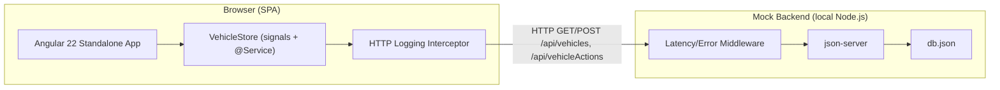

# System Design Document — Intelligent Inventory Dashboard (Scenario B)

## Overview

This document describes the architecture of a dealership vehicle-inventory dashboard built for Keyloop's technical assessment. The **frontend** service layer is fully implemented in Angular 22; the backend is mocked using `json-server`, seeded with deterministic fake data — one of the assessment's explicitly sanctioned mocking options for a frontend-only submission.

The three core requirements (verbatim from the brief) are:
1. **Inventory Visualization** — a filterable list of all vehicles (make, model, age).
2. **Aging Stock Identification** — automatically identify and prominently display vehicles in inventory **>90 days**.
3. **Actionable Insights** — allow a manager to log and persist a status/proposed action per aging vehicle.

## Architecture Diagram

The dev-server proxy (`app/proxy.conf.json`) rewrites `/api/*` to `http://localhost:3001`, so the browser only ever talks to same-origin `/api` paths; `json-server` and its middleware run as a separate local process.

## Component Roles

**`InventoryDashboard` / `VehicleDetail`** — the two routed "smart" composition roots (`/inventory` and `/inventory/:vin`). Each injects `VehicleStore` directly and composes dumb UI components underneath it; neither talks to `VehicleService`/`VehicleActionService` itself. `InventoryDashboard` renders the KPI bar, filter bar, and the vehicle table. `VehicleDetail` renders a single vehicle's details, its aging badge, its full action history (newest-first, with a deterministic id-based tie-break for same-timestamp actions), and opens `ActionLogDialog` to log a new action.

**`VehicleStore`** — the single source of truth for the whole feature. A plain `@Service()`-decorated class built from `signal()`/`computed()` (not `@ngrx/signals` — see "Technology Choices" below for why), it orchestrates `VehicleService`/`VehicleActionService`/`ClockService` and the pure domain functions, exposing reactive state (`vehicles`, `actions`, `filter`, `loading`, `error`, and derived `enrichedVehicles`/`filteredVehicles`/`agingVehicles`/`kpis`/`availableMakes`/`availableModels`) to every UI component. It is the only place HTTP calls happen.

**`VehicleService` / `VehicleActionService`** — thin HTTP boundaries (`getVehicles()`, `getAllActions()`, `logAction()`) with no business logic of their own; each method is a direct, single-purpose call to `json-server`.

**`ClockService`** — the single injectable source of "now" in the entire codebase. Every date-dependent pure function takes `asOf: Date` explicitly rather than calling `new Date()` itself, which is what makes the aging-threshold business logic deterministic and unit-testable without mocking global state.

**Domain utilities** (`inventory-age.util`, `vehicle-filter.util`, `inventory-kpi.util`, `vehicle-enrichment.util`) — pure, framework-free TypeScript functions with zero Angular dependencies. This is "the core business logic" the assessment's test-suite requirement is about: aging-threshold calculation and severity banding, filter predicate logic, KPI aggregation, and the pipeline that combines raw vehicles + actions into UI-ready enriched records.

**`LoggerService` / `AppErrorHandler` / `httpLoggingInterceptor` / `provideBrowserGlobalErrorListeners()`** — the observability layer, described in more detail below. `AppErrorHandler` and the browser global error listener are two deliberately complementary layers: the listener catches truly-uncaught `window.onerror`/`unhandledrejection` events outside Angular's own execution; `AppErrorHandler` catches errors Angular itself surfaces during change detection, template evaluation, or event handling.

**`CurrentUserService`** — a mocked, single logged-in manager identity (no real authentication is in scope). It exists specifically to make the "allow **a manager** to log an action" requirement's role boundary visible in the code rather than silently ignored, since there is no multi-user or auth system to demonstrate it against otherwise.

**`json-server` + `db.json` + `middleware.js`** — the mocked backend. `db.json` is generated once by a deterministic (`faker.seed(42)`) script and committed for reproducibility; `middleware.js` injects realistic latency (150–500ms) and an occasional (env-gated) 503 on GET requests, so the frontend's loading and error states have something real to exercise against instead of instant, always-succeeding mock responses.

## Data Flow

**GET (load) flow:** a routed component's `ngOnInit()` calls `store.load()` → `VehicleStore` issues both `VehicleService.getVehicles()` and `VehicleActionService.getAllActions()` via `forkJoin` (guarded by an incrementing request-id so a stale, out-of-order response can never clobber state from a newer `load()` call) → on success, the raw vehicles/actions are stored and `enrichVehicles()` derives `ageDays`/`isAging`/`severity`/`latestAction` per vehicle → `filteredVehicles`/`kpis`/`availableMakes`/`availableModels` are `computed()` signals derived from that, memoized automatically, and read directly by the templates.

**POST (log action) flow:** `ActionLogDialog`'s Signal Forms `submit()` closes with a composed `NewVehicleAction` (no `id`, no `createdAt`) → the opening component calls `store.logAction(result)` → `VehicleStore` stamps `createdAt` via `ClockService` (json-server auto-generates `id` on POST but never stamps `createdAt`, so the store must) and appends an optimistic entry to state immediately → `VehicleActionService.logAction()` posts the draft → on success, the optimistic entry is replaced by the server's response (matched by a request-scoped id, not by clobbering the whole array, so a second in-flight `logAction()` or a concurrent `load()` can't lose data); on failure, only that call's own optimistic entry is removed and `store.error()` is set, surfacing the failure without disturbing anything else in progress.

## Technology Choices

| Technology | Justification |
|---|---|
| Angular 22.0.6 | Verified as the latest stable release; zoneless change detection and Vitest are its actual `ng new` defaults, confirmed directly against `@schematics/angular`'s own schema — not experimental opt-ins. |
| Plain `signal()`/`computed()` + `@Service()` | `@ngrx/signals`'s published peer-dependency range does not cover Angular 22 (confirmed against the live npm registry, re-checked at implementation time) — a plain, hand-rolled store is simpler than fighting a library that doesn't support the target framework version yet. |
| Angular Material | Non-form chrome only (dialogs, buttons, cards, chips, tables) — see Signal Forms below for why it's deliberately not used for the one real form. |
| Signal Forms (`@angular/forms/signals`) | The one real form (the action-log dialog) uses Signal Forms bound to **native** `<select>`/`<textarea>` elements rather than Material form controls, since Material's CVA compatibility with `[formField]` wasn't confirmed at design time (later verified directly against the published `@angular/forms@22.0.6` source during implementation — native elements are explicitly supported). |
| `json-server` 0.17.4 + `@faker-js/faker` | A real HTTP boundary with persisted mutations, as opposed to `in-memory-web-api`, MSW, or a fake interceptor — this matters because the HTTP logging interceptor and the latency/error-injection middleware both need genuine network round-trips to be meaningful. Pinned to the last stable pre-1.0 release, not the in-progress `1.0.0-beta.x` rewrite, for reproducibility. |
| Vitest | Angular 22's own default test runner (confirmed via the CLI's `@angular/build:unit-test` builder and an official `migrate-karma-to-vitest` schematic), used with the zoneless "Act, Wait, Assert" pattern (`await fixture.whenStable()`, never `fixture.detectChanges()`). |
| Playwright | A small, critical-path e2e suite (filter → detail → log action) proving the unit-tested business logic is actually wired into the running UI — unit tests alone don't prove that. |
| `NgOptimizedImage` | Used for vehicle photo thumbnails and the detail-page image, satisfying the project's static-image performance convention. |

## Build for the Future

The assessment asks every submission to address scalability, performance, reliability, and maintainability explicitly (observability has its own section next, per the brief's specific "logging, metrics, tracing" phrasing).

- **Scalability.** `Vehicle.dealershipId` is modeled now specifically so a future multi-site dealership switcher is additive, not a rewrite — today there's a single implicit dealership, but the data shape already carries the field a real deployment would filter/partition on. The domain layer is pure and stateless, so it would parallelize or move behind a real backend service trivially if the mocked backend were ever replaced.
- **Performance.** Zoneless change detection and tree-shakeable `@Service()` singletons keep the runtime and bundle lean; feature routes are lazy-loaded (`loadComponent()`) so `InventoryDashboard` and `VehicleDetail` ship as separate chunks, confirmed in the production build; `NgOptimizedImage` handles vehicle photos; `computed()` signals memoize every derived value (`filteredVehicles`, `kpis`, `availableModels`) so nothing recomputes unless its actual inputs changed.
- **Reliability.** `VehicleStore.logAction()` is optimistic with a real rollback path scoped to only its own entry (a fix applied after code review found the original rollback could clobber a *different*, concurrently-succeeded action); `load()`'s request-id guard prevents a stale, out-of-order HTTP response from overwriting newer state; the mock server's injected latency and occasional 503s (disabled during e2e runs via an `ERROR_RATE` env override) exist specifically so the loading and error UI paths are exercised against something real during manual testing, not left as an untested happy-path assumption.
- **Maintainability.** Strict `domain/`/`data-access/`/`ui/`/`feature/` layering keeps business logic pure, framework-free, and independently unit-tested; one `VehicleStore` is the single source of truth so no component ever talks to an HTTP service directly; `ClockService` removes hidden global-clock coupling from every date-based function, which is also what keeps the aging-threshold logic deterministic in tests.

## Observability Strategy

**Implemented:**
- `LoggerService` — a small leveled logger (`.info`/`.warn`/`.error`), every line timestamped via `ClockService` rather than a raw `Date`.
- `httpLoggingInterceptor` — logs method, URL, response status, and duration for every HTTP request, on both the success and error paths.
- `AppErrorHandler` + `provideBrowserGlobalErrorListeners()` — two complementary error-catching layers: the global listener catches truly-uncaught browser-level errors outside Angular's own execution; `AppErrorHandler` catches errors Angular itself surfaces during change detection, template evaluation, or event handling.

**Documented as a production roadmap, not built** (out of scope for a locally-mocked demo, but the natural next steps for a real deployment): correlation-ID propagation into a real backend, OpenTelemetry-Web distributed tracing, RUM/APM integration, and Core Web Vitals reporting.

## GenAI Collaboration in the Design Phase

Claude Code (Sonnet 5) was used to read the challenge brief, draft this System Design Document and the full implementation plan before any code was written, and then execute that plan task-by-task. Two independent second-opinion reviews (one Gemini-backed, one Codex/GPT-5.5-backed) were requested against the original draft architecture specifically to stress-test it before implementation began. A subsequent revision pass — driven by the user's own Angular/TypeScript style guide (`docs/best-practices.md`), the official `angular-developer`/`angular-new-app` Claude Code skills, and a project-scoped `angular-cli` MCP server — changed several concrete decisions rather than leaving them as initial assumptions:

- **Dropped `@ngrx/signals`** for the hand-rolled `signal()`/`@Service()` store, after downloading the actual published package (not guessing from memory) and confirming its peer-dependency range doesn't cover Angular 22.
- **Adopted Vitest and zoneless change detection** not because they seemed fashionable, but because inspecting the real `@schematics/angular` package's own schema showed they are Angular 22's literal, unconditional defaults.
- **Kept the action-log form on native HTML elements** rather than Angular Material form controls, since Material's CVA compatibility with Signal Forms' `[formField]` directive wasn't confirmed at design time — later verified directly against the published `@angular/forms@22.0.6` source during implementation, confirming native elements (including `<select>`) are the documented, supported path.
- **Added `NgOptimizedImage` thumbnails** because an earlier draft had an `imageUrl` field on every vehicle that nothing ever actually rendered — the best-practices doc's image-handling rule would have been vacuously satisfied without a real consumer of it.

The full account of how GenAI was used during *implementation* — including every real bug a review pass caught, and how each was verified and fixed — is in the README's dedicated AI Collaboration Narrative section, not repeated here.

## Note on Ambiguity

The assessment brief notes that its scenarios are deliberately underspecified in places and asks for documented, reasonable assumptions rather than guesses. The following were made and are treated as binding decisions throughout this codebase:

1. **Single dealership scope.** Vehicles carry a `dealershipId` field for future multi-site extension, but there is no dealership switcher UI in this build.
2. **Aging threshold** is fixed at **>90 days** per the spec. Severity bands (`fresh` ≤30d, `watch` 31–90d, `aging` 91–180d, `critical` >180d) are a non-required UX layer on top, not a reinterpretation of the binary rule.
3. **"Status or proposed action"** is a constrained enum (`VehicleActionType`) plus a free-text note, with a full history persisted per vehicle (audit trail) — the most recent one is surfaced as "current status."
4. **VIN doubles as the `id`** json-server requires on every resource.
5. **No real authentication.** A trivial `CurrentUserService` simulates one logged-in manager.
6. **"Real-time"** means "reflects latest state immediately after each load/mutation," not literal server push — documented as a production extension, not implemented.
7. **Angular pinned to 22.0.6** (the latest stable major as of this build), with `@ngrx/signals` dropped in favor of a plain `signal()`/`@Service()` store specifically because `@ngrx/signals` doesn't yet support Angular 22.
8. **`json-server` pinned to stable `0.17.4`**, not the in-progress `1.0.0-beta.x` rewrite, for reproducibility in a graded submission.
9. **Zoneless change detection and Vitest are used because they are Angular 22's actual defaults**, not because this build opted into an experimental feature.
10. **`NgOptimizedImage` against `picsum.photos` mock images** emits a soft "unrecognized image loader" console advisory; this is expected and left as-is (a real deployment would point at a CDN with a registered `NgOptimizedImage` loader).
